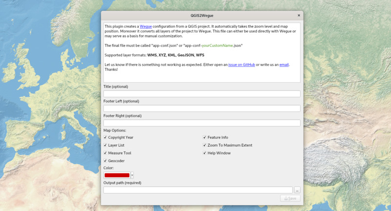

# QGIS2Wegue QGIS Plugin

Configuring your Wegue application by hand can be laborious. This is where QGIS plugin `QGIS2Wegue` ([GitHub Repository](https://github.com/meggsimum/qgis2wegue)) comes in handy. It derives a valid Wegue application configuration from your QGIS project:

- All layers of a QGIS project are converted into a valid Wegue layer configuration. This works for `WMS`, `XYZ`, `KML`, `GeoJSON`, `WFS`
- The map extent is taken over to the configuration
- Textual elements, like title and footer can be set in a GUI
- Modules to be included in your Wegue application can be easily added / removed via the GUI

## Usage

- Add all your desired layers to QGIS
- Center the map to your area of interest
- Open the plugin, chose a filepath (optionally add some custom settings) and click `OK`
- Now you have a configuration file that works with Wegue

## Installation

QGIS2Wegue is available in the offical [QGIS plugin repository](https://plugins.qgis.org/plugins/qgis2wegue/). Download via `Plugins` --> `Manage and Install Plugins ...`. Make sure to enable `experimental` plugins in the `Settings` menu.
